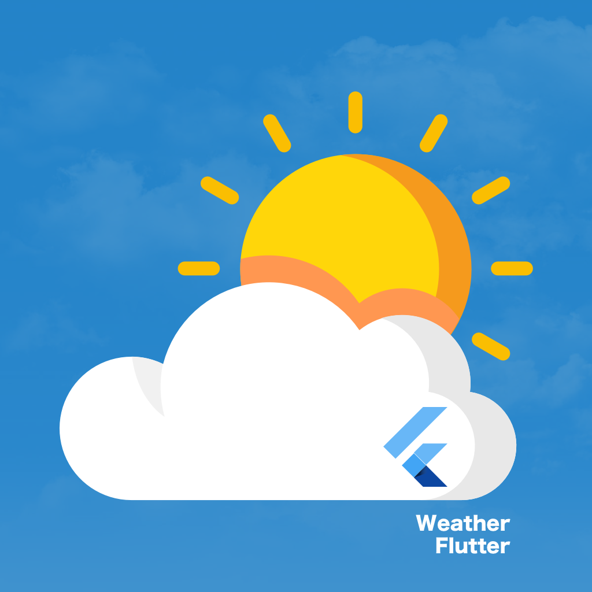
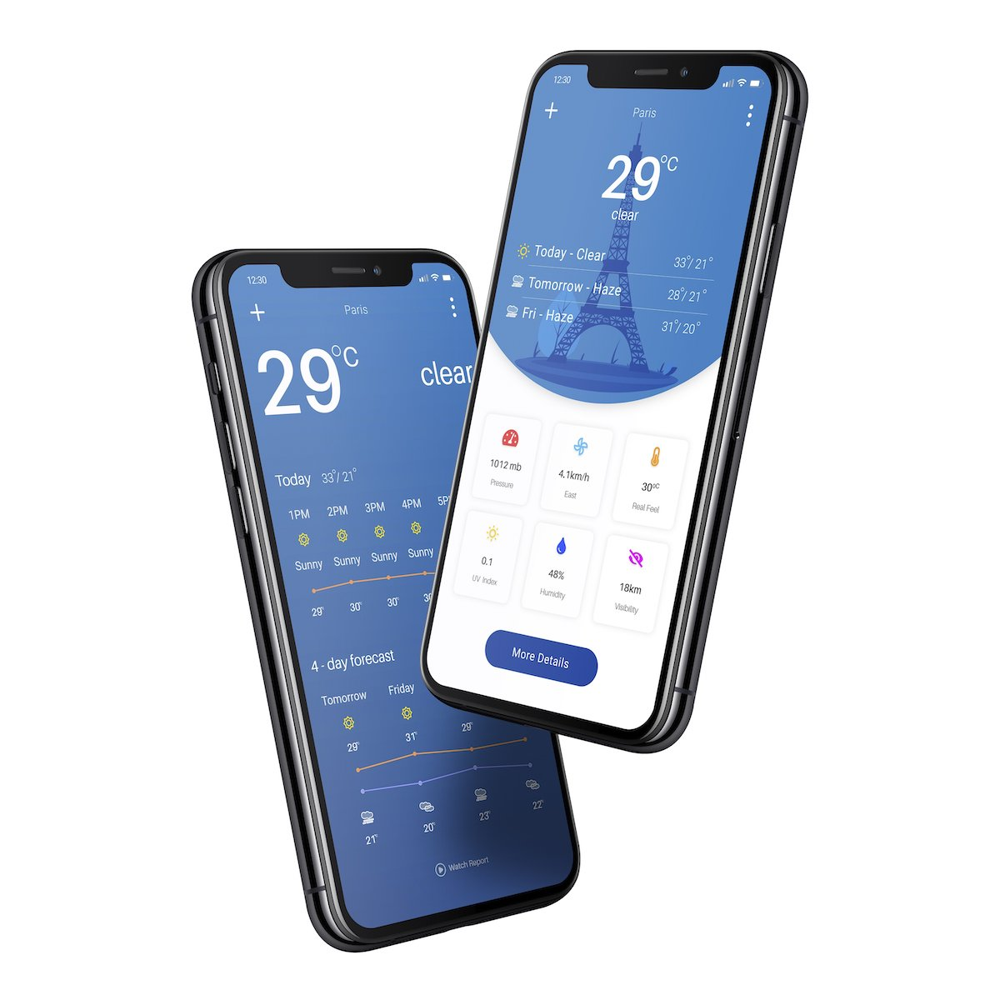
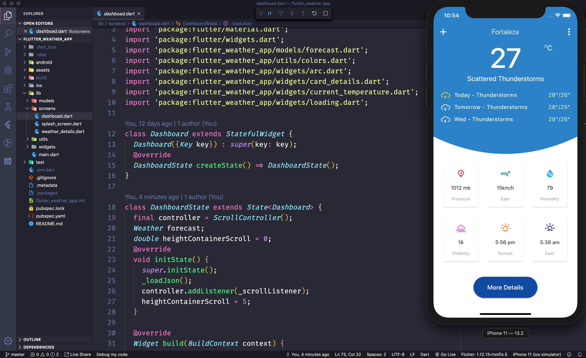
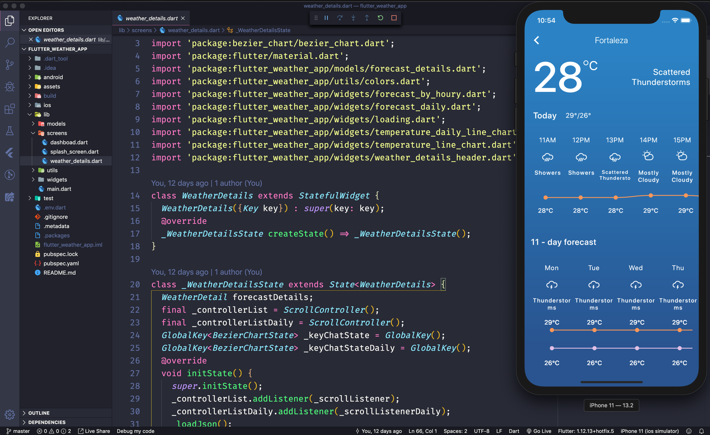
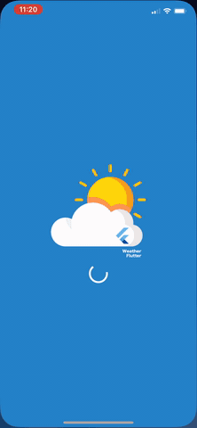

<p align="center">
  <a href="https://github.com/cleandersonlobo/flutter_weather_app/">
    
  </a>

  <h1 align="center">flutter_weather_app</h1>

  <p align="center">
    The Weather App UI Design made with Flutter.  <br /><a href="https://www.uplabs.com/posts/weather-app-6618236e-d929-4eb3-94de-d353a014a3f5">Design found here</a>
    
  </p>
  <p align="center">
  <a href="https://github.com/cleandersonlobo/flutter_weather_app/issues/new">Request feature</a> |
  <a href="https://github.com/cleandersonlobo/flutter_weather_app/issues/new">Report bug</a>
  <p>
</p>

## Show Support
* [Recommend Me On LinkedIn](https://www.linkedin.com/in/cleandersonlobo/) - I will realy Appriciate this
* Don't forget to star ⭐ the repo 😉, it's FREE.


### Design



##  implementation (Dashboard)


##  implementation (Forecast Details)



## Running



### Weather Data

- [Yahoo Weather API](https://developer.yahoo.com/weather/)


### Dependencies
```yaml
  cupertino_icons: ^0.1.2

  flutter_svg: ^0.15.0

  bezier_chart: "^1.0.15"

  intl: ^0.16.1

  auto_size_text: ^2.1.0

  page_transition: "^1.1.5"
 ```

 ## Getting Started

This project is a starting point for a Flutter application.

A few resources to get you started if this is your first Flutter project:

- [Lab: Write your first Flutter app](https://flutter.dev/docs/get-started/codelab)
- [Cookbook: Useful Flutter samples](https://flutter.dev/docs/cookbook)

For help getting started with Flutter, view our
[online documentation](https://flutter.dev/docs), which offers tutorials,
samples, guidance on mobile development, and a full API reference.


## Author

*	[Cleanderson Lobo](mailto:cleandersonlobo@gmail.com)


## React Native 

The same challenge but made with React Native

- [react-native-weather](https://github.com/cleandersonlobo/react-native-weather)